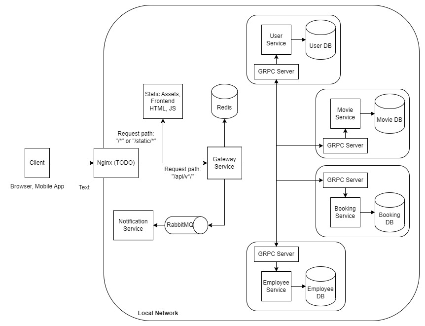

# Movie Booking Microservices Project

Mini-project of a movie booking system.

## Architecture diagram:  

The main communication method used by this system is RPC (Remote Procedure Call) using gRPC framework.  

This system consists of 6 services:
- Gateway  
  Acts as the gateway for all requests to enter the system. It also handles authentication, route permissions, and calls other services to process or get data owned by them.  

- Movie  
  Manages movies, directors, and actors data. 

- Employee  
  Manages employee data, including employee authentication check.

- User  
  Manages user data, creating new accounts, and signing in.

- Bookings  
  Manages schedules and bookings.

- Notification (not implemented yet)    
  Allows sending email, SMS, or mobile notification. Unlike other services that communicate using gRPC, this service reads from a message queue because this service can work asynchronously (caller sends a request and not expect a response).

## Limitations:
- Some of the parts are not yet implemented: nginx as reverse proxy for serving API and static assets, notification service, etc.
- Error messages are still not properly formatted for users, currently it is displaying Go error strings.
- No automated unit or integration testing. Http tests are provided in `http_tests` directory and can be run with Vscode http client extension.

## Running:
1. Prerequisites: `docker` (docker compose installed) and `python3` (>3.8) installed.
2. Run `docker compose up` to build and start.
3. You can access the gateway from `http://localhost:8080`. Some testing routes are available in `http_tests` directory.